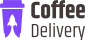

<h1 align="center">
  
</h1>

  Está é uma aplicação de delivery de café, o usuário escolhe os tipos e as quantidades de café, preenche os dados de pagamentos e recebe no conforto da sua casa.

<h2 align="center">Tabela de Conteúdos</h2>

  • <a href="#sobre">Sobre</a>
  • <a href="#funcionalidades">Funcionalidades</a>
  • <a href="#layout">Layout</a>
  • <a href="#tecnologias">Tecnologias</a> 
  • <a href="#status">Status do Projeto</a> 
  • <a href="#autor">Autor</a>
  • <a href="#licenca">Licença</a>

<h2 align="center" id="sobre">Sobre</h2>

  Está é uma aplicação de delivery de café, o usuário escolhe os tipos e as quantidades de café, adiciona ao carrinho de compras, verifica o preço a pagar incluindo a taxa de entrega, preenche os dados de entrega e a forma de pagamento, que pode ser cartão de crédito, débito ou dinheiro. Após confirmar basta o usuário aguardar seus deliciosos cafés.

<h3 align="left" id="funcionalidades">Funcionalidades</h3>

- [x] Adiconar os cafés no carrinho de compras;
- [x] Remover os cafés do carrinho de compras;
- [x] Confirma o pagamento dos seus produtos;

<h2 align="left" id="layout">🎨 Layout</h2>

O layout da aplicação está disponível no Figma:

<h3 align="left" id="layout">Versão Web</h3>

<h3 align="left" id="layout">Versão Mobile</h3>

<h3 align="left" id="tecnologias">🛠 Tecnologias</h3>

As seguintes Tecnologias e Ferramentas que foram usadas na construção do projeto

- [Vite](https://vitejs.dev/)
- [ReactJS](https://pt-br.reactjs.org/)
- [TypeScript](https://www.typescriptlang.org/)
- [Styled-components](https://styled-components.com/)
- [Material.UI](https://mui.com/pt/)
- [PhosphorIcons](https://phosphoricons.com/)
- [Redux-Toolkit](https://redux-toolkit.js.org/usage/usage-guide)
- [React-Redux](https://react-redux.js.org/introduction/getting-started)
- [React-Router-Dom](https://v5.reactrouter.com/web/guides/quick-start)
- [React-Hook-Form](https://react-hook-form.com/)
- [ZOD](https://zod.dev/)

<h2 align="left" id="status">Status do Projeto</h2>

 🚧  ViteJS & ReactJS 🚀 Versão 1.0 Finalizada.  🚧.

<h2 align="left" id="link-online">Versão Online</h2>

- [Lins-Coffee-Delivery](https://lins-coffee-delivery.vercel.app/)

<h2 align="left" id="autor">🦸 Autor</h2>
<a href="https://github.com/JailsonSantos">
 
  
 <b>Jailson Santos</b></a> <a href="https://www.linkedin.com/in/jailson-santos-726395104/" title="Jailson Santos">🚀</a>
  

 

<h2 align="left" id="licenca">📝 Licença</h2>

Este projeto esta sobe a licença [MIT](./LICENSE).

Feito com ❤️ por Jailson Santos 👋🏽 [Entre em contato!](https://www.linkedin.com/in/jailson-santos-726395104/)